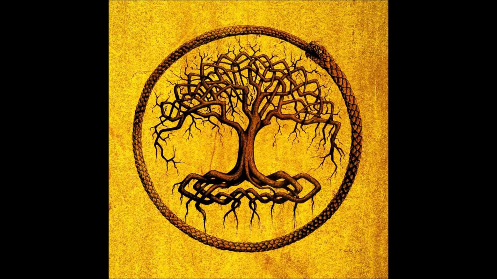

# About
askygg (æskɪg, ASK-igg) is an image editor application, developed in C++ with an OpenGL graphics API backend, that offers two operational modes: headless and editor. 

# Usage
From the project root directory, open the settings.json file and update the fields.  A description of each field is outlined below.

<ul>
<li> `input_dir: The absolute path of the input directory.  In the case of editor mode, this directory should contain a smaller sample of the image batch you intend to process in headless mode.  In headless mode, this directory should contain the entire set of images you want processed.
<li> `ouput_dir`: The absolute path of the destination of the application output (the enhanced images).
<li> `config_file`: The absolute path to your configuration file.  By default, a configuration file calibrated for night-time enhancement will be provided in the root directory.
</ul>
Once you're satisfied with the settings.json file, run the following command to build the project:
<pre>
python setup.py
</pre>
Once setup is complete, run the following command to run in editor mode or headless mode respectively:
<pre>
python run.py --mode editor
python run.py --mode headless
</pre>

By default, run.py runs askygg in release mode, to run in debug
<pre>
python run.py --mode editor --build_type debug
python run.py --mode headless --build_type debug
</pre>
